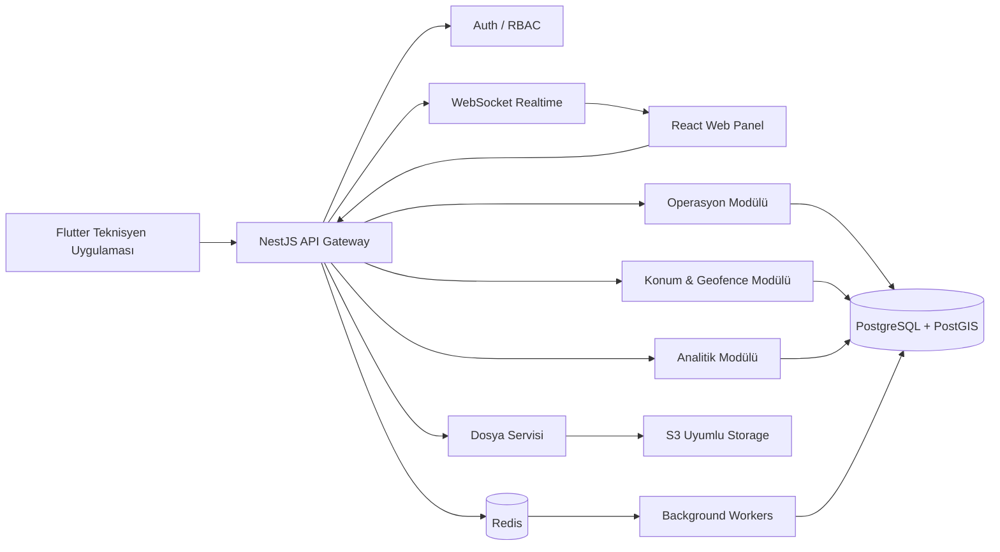

# Dijital Pest Control ve Saha Operasyon Platformu

Sürüm: MVP teknik döküm  
Hedef: Endüstriyel müşteriler, saha teknisyenleri ve şirket yöneticileri için çok rollü SaaS platformu  
Tasarım yaklaşımı: sade, güvenilir, operasyon odaklı

---

## 1. Ürün Özeti

Bu platform; pest control saha operasyonlarını dijitalleştiren, tesis içi istasyon kontrollerini QR ile doğrulayan, teknisyen konumlarını takip eden ve yönetime denetlenebilir performans/aktivite verisi sunan bir SaaS üründür.

Temel değer önerisi:

- Müşteri, kendi tesisindeki istasyon durumlarını ve trendleri şeffaf şekilde görür.
- Teknisyen, günlük rotasını ve kontrol formlarını mobil uygulamadan offline-first şekilde tamamlar.
- Yönetici, sahadaki personeli, gerçek iş başlangıçlarını, konum loglarını ve operasyon performansını denetler.

---

## 2. Roller ve Yetkiler

| Rol | Ana Kullanım | Yetkiler |
|---|---|---|
| Şirket Yöneticisi / Patron | Tüm operasyonu yönetir | Tüm müşteriler, tesisler, personel, canlı konum, raporlar, denetim logları |
| Operasyon Yöneticisi | Günlük planlama yapar | Rota, iş emri, teknisyen atama, rapor inceleme |
| Saha Teknisyeni | Mobil uygulama ile işi yapar | Günlük rota, QR tarama, form doldurma, fotoğraf yükleme, offline kayıt |
| Endüstriyel Müşteri | Kendi tesisini izler | Kendi tesis planları, istasyon durumları, trendler, raporlar |
| Sistem Admin | SaaS yönetimi | Tenant, abonelik, kullanıcı, rol, sistem ayarları |

Yetkilendirme modeli RBAC olmalıdır. SaaS yapısı için her ana tabloda `tenant_id` bulunmalı ve veri izolasyonu zorunlu tutulmalıdır.

---

## 3. Önerilen Teknoloji Mimarisi

### 3.1 Genel Tercih

| Katman | Öneri | Neden |
|---|---|---|
| Web panel | React + TypeScript + Vite | Bileşen bazlı yapı, güçlü ekosistem, hızlı geliştirme |
| Mobil uygulama | Flutter | iOS/Android için tek kod tabanı, saha uygulamaları için güçlü offline ve cihaz API desteği |
| Backend | Node.js + NestJS + TypeScript | Modüler, kurumsal mimariye uygun, test edilebilir yapı |
| Veritabanı | PostgreSQL + PostGIS | İlişkisel veri, coğrafi sorgular, raporlama ve tutarlılık |
| Cache / Queue | Redis + BullMQ | Canlı konum, job queue, sync işlemleri |
| Dosya depolama | S3 uyumlu storage | Kat planları, fotoğraflar, rapor PDF’leri |
| Realtime | WebSocket / Socket.IO | Canlı personel haritası ve anlık durum güncellemeleri |
| Harita | Mapbox veya Google Maps | Canlı GPS, rota, geofence görselleştirme |
| Web kat planı | Konva.js veya Fabric.js | Plan üzerinde istasyon ikonları ve koordinat yönetimi |
| Grafikler | Recharts veya Apache ECharts | Dashboard trend grafikleri |
| Heatmap | deck.gl veya Mapbox heatmap layer | Yoğunluk haritaları |
| Auth | JWT + refresh token + optional SSO | SaaS ürün için güvenli oturum |
| Observability | OpenTelemetry + Grafana/Loki/Sentry | Üretim ortamında izlenebilirlik |

React’in resmi dokümanları arayüzlerin bileşenlerden oluşturulmasını temel model olarak konumlandırır. Flutter resmi olarak tek kod tabanıyla çoklu platform uygulama geliştirmeyi hedefler. NestJS, TypeScript destekli ölçeklenebilir Node.js backend yapısı sunar. PostGIS ise PostgreSQL’e coğrafi veri saklama, indeksleme ve sorgulama yetenekleri ekler.

### 3.2 Neden PostgreSQL + PostGIS?

Bu ürün; müşteri, tesis, iş emri, QR log, form, bulgu, rapor ve ödeme gibi çok ilişkili veriler içerir. Bu nedenle MongoDB yerine PostgreSQL daha güvenli ana tercih olur.

PostGIS ile:

- Tesis konumu ve geofence alanı saklanabilir.
- Teknisyenin tesise girip girmediği sorgulanabilir.
- Yakındaki görevler ve rota optimizasyonu yapılabilir.
- Canlı personel haritası için spatial index kullanılabilir.

MongoDB yalnızca yüksek hacimli ham telemetri arşivi için ikincil sistem olarak değerlendirilebilir. MVP’de gerekmez.

---

## 4. Yüksek Seviye Sistem Mimarisi



### Backend modülleri

- Auth Module: login, refresh token, MFA opsiyonu, rol bazlı yetki
- Tenant Module: SaaS müşteri şirket yönetimi
- User Module: personel, müşteri kullanıcısı, admin
- Facility Module: tesis, kat planı, geofence
- Station Module: istasyon, QR kod, koordinat, durum
- Work Order Module: görev, rota, ziyaret planı
- Inspection Module: QR tarama, form cevapları, fotoğraf, bulgu
- Location Module: GPS ping, geofence event, canlı durum
- Analytics Module: trend, heatmap, müşteri raporu
- Notification Module: push notification, e-posta, kritik aktivite uyarısı
- Audit Module: değişiklik logları ve denetim izi
- Sync Module: mobil offline veri senkronizasyonu

---

## 5. Veritabanı Şeması

Aşağıdaki şema MVP için üretime yakın bir başlangıç modelidir.

### 5.1 PostgreSQL Extension

```sql
CREATE EXTENSION IF NOT EXISTS "uuid-ossp";
CREATE EXTENSION IF NOT EXISTS postgis;
```

### 5.2 Tenant ve Kullanıcılar

```sql
CREATE TABLE tenants (
    id UUID PRIMARY KEY DEFAULT uuid_generate_v4(),
    name VARCHAR(160) NOT NULL,
    legal_name VARCHAR(200),
    status VARCHAR(30) NOT NULL DEFAULT 'active',
    created_at TIMESTAMPTZ NOT NULL DEFAULT now(),
    updated_at TIMESTAMPTZ NOT NULL DEFAULT now()
);

CREATE TABLE users (
    id UUID PRIMARY KEY DEFAULT uuid_generate_v4(),
    tenant_id UUID NOT NULL REFERENCES tenants(id),
    full_name VARCHAR(160) NOT NULL,
    email VARCHAR(180) UNIQUE NOT NULL,
    phone VARCHAR(40),
    password_hash TEXT NOT NULL,
    role VARCHAR(40) NOT NULL CHECK (role IN (
        'system_admin',
        'company_owner',
        'operations_manager',
        'technician',
        'customer_user'
    )),
    status VARCHAR(30) NOT NULL DEFAULT 'active',
    last_login_at TIMESTAMPTZ,
    created_at TIMESTAMPTZ NOT NULL DEFAULT now(),
    updated_at TIMESTAMPTZ NOT NULL DEFAULT now()
);

CREATE INDEX idx_users_tenant_role ON users(tenant_id, role);
```

### 5.3 Müşteri, Tesis, Kat Planı

```sql
CREATE TABLE customers (
    id UUID PRIMARY KEY DEFAULT uuid_generate_v4(),
    tenant_id UUID NOT NULL REFERENCES tenants(id),
    name VARCHAR(180) NOT NULL,
    sector VARCHAR(80),
    contact_name VARCHAR(160),
    contact_email VARCHAR(180),
    contact_phone VARCHAR(40),
    created_at TIMESTAMPTZ NOT NULL DEFAULT now()
);

CREATE TABLE facilities (
    id UUID PRIMARY KEY DEFAULT uuid_generate_v4(),
    tenant_id UUID NOT NULL REFERENCES tenants(id),
    customer_id UUID NOT NULL REFERENCES customers(id),
    name VARCHAR(180) NOT NULL,
    address TEXT,
    location GEOGRAPHY(Point, 4326),
    geofence GEOGRAPHY(Polygon, 4326),
    geofence_radius_m INTEGER DEFAULT 150,
    created_at TIMESTAMPTZ NOT NULL DEFAULT now(),
    updated_at TIMESTAMPTZ NOT NULL DEFAULT now()
);

CREATE INDEX idx_facilities_location ON facilities USING GIST(location);
CREATE INDEX idx_facilities_geofence ON facilities USING GIST(geofence);

CREATE TABLE floor_plans (
    id UUID PRIMARY KEY DEFAULT uuid_generate_v4(),
    tenant_id UUID NOT NULL REFERENCES tenants(id),
    facility_id UUID NOT NULL REFERENCES facilities(id),
    name VARCHAR(120) NOT NULL,
    file_url TEXT NOT NULL,
    file_type VARCHAR(20) NOT NULL CHECK (file_type IN ('png', 'jpg', 'jpeg', 'svg', 'pdf')),
    width_px INTEGER,
    height_px INTEGER,
    created_at TIMESTAMPTZ NOT NULL DEFAULT now()
);
```

### 5.4 İstasyonlar ve QR Kodlar

```sql
CREATE TABLE stations (
    id UUID PRIMARY KEY DEFAULT uuid_generate_v4(),
    tenant_id UUID NOT NULL REFERENCES tenants(id),
    facility_id UUID NOT NULL REFERENCES facilities(id),
    floor_plan_id UUID REFERENCES floor_plans(id),
    code VARCHAR(80) NOT NULL,
    name VARCHAR(120),
    station_type VARCHAR(40) NOT NULL CHECK (station_type IN (
        'rodent',
        'crawler',
        'flying',
        'insect_light_trap',
        'other'
    )),
    qr_token VARCHAR(120) UNIQUE NOT NULL,
    x NUMERIC(10, 4),
    y NUMERIC(10, 4),
    status VARCHAR(30) NOT NULL DEFAULT 'unchecked' CHECK (status IN (
        'clean',
        'activity',
        'unchecked',
        'damaged',
        'missing'
    )),
    last_checked_at TIMESTAMPTZ,
    created_at TIMESTAMPTZ NOT NULL DEFAULT now(),
    updated_at TIMESTAMPTZ NOT NULL DEFAULT now(),
    UNIQUE (tenant_id, facility_id, code)
);

CREATE INDEX idx_stations_facility_status ON stations(facility_id, status);
CREATE INDEX idx_stations_qr_token ON stations(qr_token);
```

### 5.5 İş Emirleri, Rota ve Zaman Damgalı Loglar

```sql
CREATE TABLE work_orders (
    id UUID PRIMARY KEY DEFAULT uuid_generate_v4(),
    tenant_id UUID NOT NULL REFERENCES tenants(id),
    customer_id UUID NOT NULL REFERENCES customers(id),
    facility_id UUID NOT NULL REFERENCES facilities(id),
    technician_id UUID NOT NULL REFERENCES users(id),
    scheduled_start_at TIMESTAMPTZ NOT NULL,
    scheduled_end_at TIMESTAMPTZ,
    status VARCHAR(40) NOT NULL DEFAULT 'scheduled' CHECK (status IN (
        'scheduled',
        'on_the_way',
        'arrived_gps',
        'started_by_first_qr',
        'in_progress',
        'completed',
        'cancelled',
        'requires_review'
    )),
    route_order INTEGER,
    notes TEXT,
    created_at TIMESTAMPTZ NOT NULL DEFAULT now(),
    updated_at TIMESTAMPTZ NOT NULL DEFAULT now()
);

CREATE INDEX idx_work_orders_technician_date
ON work_orders(technician_id, scheduled_start_at);

CREATE TABLE work_order_logs (
    id UUID PRIMARY KEY DEFAULT uuid_generate_v4(),
    tenant_id UUID NOT NULL REFERENCES tenants(id),
    work_order_id UUID NOT NULL REFERENCES work_orders(id),
    technician_id UUID NOT NULL REFERENCES users(id),
    event_type VARCHAR(50) NOT NULL CHECK (event_type IN (
        'departed',
        'arrived_gps',
        'entered_geofence',
        'first_qr_scanned',
        'station_qr_scanned',
        'last_qr_scanned',
        'left_geofence',
        'completed',
        'manual_note',
        'sync_uploaded'
    )),
    event_time TIMESTAMPTZ NOT NULL,
    location GEOGRAPHY(Point, 4326),
    station_id UUID REFERENCES stations(id),
    metadata JSONB NOT NULL DEFAULT '{}',
    mobile_event_id UUID,
    created_at TIMESTAMPTZ NOT NULL DEFAULT now()
);

CREATE INDEX idx_work_order_logs_work_order_time
ON work_order_logs(work_order_id, event_time);

CREATE INDEX idx_work_order_logs_location
ON work_order_logs USING GIST(location);

CREATE UNIQUE INDEX idx_work_order_logs_mobile_event_dedup
ON work_order_logs(mobile_event_id)
WHERE mobile_event_id IS NOT NULL;
```

Önemli kural: İş emri sadece `arrived_gps` ile gerçek başlamış sayılmaz. İlk QR okutulduğunda `first_qr_scanned` logu atılır ve iş emri `started_by_first_qr` durumuna geçer. Yönetici panelindeki “Gerçek Mesai Başlangıcı” bu zamandır.

### 5.6 Kontrol Formları ve Bulgular

```sql
CREATE TABLE inspection_forms (
    id UUID PRIMARY KEY DEFAULT uuid_generate_v4(),
    tenant_id UUID NOT NULL REFERENCES tenants(id),
    name VARCHAR(120) NOT NULL,
    station_type VARCHAR(40),
    schema JSONB NOT NULL,
    version INTEGER NOT NULL DEFAULT 1,
    is_active BOOLEAN NOT NULL DEFAULT true,
    created_at TIMESTAMPTZ NOT NULL DEFAULT now()
);

CREATE TABLE inspections (
    id UUID PRIMARY KEY DEFAULT uuid_generate_v4(),
    tenant_id UUID NOT NULL REFERENCES tenants(id),
    work_order_id UUID NOT NULL REFERENCES work_orders(id),
    station_id UUID NOT NULL REFERENCES stations(id),
    technician_id UUID NOT NULL REFERENCES users(id),
    form_id UUID REFERENCES inspection_forms(id),
    scanned_at TIMESTAMPTZ NOT NULL,
    status VARCHAR(30) NOT NULL CHECK (status IN (
        'clean',
        'activity',
        'damaged',
        'missing',
        'needs_follow_up'
    )),
    pest_type VARCHAR(40) CHECK (pest_type IN (
        'rodent',
        'crawler',
        'flying',
        'other'
    )),
    activity_count INTEGER DEFAULT 0,
    answers JSONB NOT NULL DEFAULT '{}',
    notes TEXT,
    created_at TIMESTAMPTZ NOT NULL DEFAULT now()
);

CREATE INDEX idx_inspections_station_time ON inspections(station_id, scanned_at);
CREATE INDEX idx_inspections_pest_type_time ON inspections(pest_type, scanned_at);

CREATE TABLE inspection_photos (
    id UUID PRIMARY KEY DEFAULT uuid_generate_v4(),
    tenant_id UUID NOT NULL REFERENCES tenants(id),
    inspection_id UUID NOT NULL REFERENCES inspections(id),
    file_url TEXT NOT NULL,
    created_at TIMESTAMPTZ NOT NULL DEFAULT now()
);

CREATE TABLE analytics_findings (
    id UUID PRIMARY KEY DEFAULT uuid_generate_v4(),
    tenant_id UUID NOT NULL REFERENCES tenants(id),
    facility_id UUID NOT NULL REFERENCES facilities(id),
    station_id UUID REFERENCES stations(id),
    pest_type VARCHAR(40) NOT NULL,
    severity VARCHAR(20) NOT NULL CHECK (severity IN ('low', 'medium', 'high', 'critical')),
    activity_count INTEGER NOT NULL DEFAULT 0,
    period_start DATE NOT NULL,
    period_end DATE NOT NULL,
    heatmap_weight NUMERIC(8, 2) NOT NULL DEFAULT 0,
    metadata JSONB NOT NULL DEFAULT '{}',
    created_at TIMESTAMPTZ NOT NULL DEFAULT now()
);

CREATE INDEX idx_analytics_facility_period
ON analytics_findings(facility_id, period_start, period_end);
```

### 5.7 Canlı Konum ve Geofence Eventleri

```sql
CREATE TABLE technician_location_pings (
    id UUID PRIMARY KEY DEFAULT uuid_generate_v4(),
    tenant_id UUID NOT NULL REFERENCES tenants(id),
    technician_id UUID NOT NULL REFERENCES users(id),
    work_order_id UUID REFERENCES work_orders(id),
    location GEOGRAPHY(Point, 4326) NOT NULL,
    accuracy_m NUMERIC(8, 2),
    speed_mps NUMERIC(8, 2),
    battery_level INTEGER,
    source VARCHAR(30) NOT NULL CHECK (source IN ('foreground', 'background', 'geofence', 'manual')),
    captured_at TIMESTAMPTZ NOT NULL,
    created_at TIMESTAMPTZ NOT NULL DEFAULT now()
);

CREATE INDEX idx_location_pings_technician_time
ON technician_location_pings(technician_id, captured_at DESC);

CREATE INDEX idx_location_pings_location
ON technician_location_pings USING GIST(location);

CREATE TABLE geofence_events (
    id UUID PRIMARY KEY DEFAULT uuid_generate_v4(),
    tenant_id UUID NOT NULL REFERENCES tenants(id),
    technician_id UUID NOT NULL REFERENCES users(id),
    facility_id UUID NOT NULL REFERENCES facilities(id),
    work_order_id UUID REFERENCES work_orders(id),
    event_type VARCHAR(20) NOT NULL CHECK (event_type IN ('enter', 'exit')),
    event_time TIMESTAMPTZ NOT NULL,
    location GEOGRAPHY(Point, 4326),
    created_at TIMESTAMPTZ NOT NULL DEFAULT now()
);
```

---

## 6. API Tasarımı

### Auth

- `POST /auth/login`
- `POST /auth/refresh`
- `POST /auth/logout`
- `GET /auth/me`

### Web Panel

- `GET /dashboard/summary`
- `GET /customers`
- `POST /customers`
- `GET /facilities/:id`
- `POST /facilities/:id/floor-plans`
- `GET /facilities/:id/stations`
- `POST /stations`
- `PATCH /stations/:id`
- `GET /analytics/trends`
- `GET /analytics/heatmap`
- `GET /technicians/live`
- `GET /technicians/:id/timeline`

### Mobil

- `GET /mobile/today-route`
- `POST /mobile/location-pings`
- `POST /mobile/work-orders/:id/arrive`
- `POST /mobile/qr/scan`
- `POST /mobile/inspections`
- `POST /mobile/sync`
- `GET /mobile/sync/bootstrap`

### Sync prensibi

Mobil uygulamadaki her offline event için `mobile_event_id` üretilir. Sunucu bu ID ile idempotent çalışır. Böylece internet gidip geldiğinde aynı QR veya form kaydı iki kez yazılmaz.

---

## 7. Mobil Offline-First Tasarım

### Yerel veri

Flutter tarafında:

- SQLite: `drift` veya `sqflite`
- Alternatif hafif key-value: Hive
- QR okuma: `mobile_scanner`
- Konum: `geolocator`
- Background task: Android WorkManager, iOS BGTask + significant location changes

Yerel tablolar:

- `local_work_orders`
- `local_stations`
- `local_forms`
- `local_qr_events`
- `local_inspections`
- `local_photos`
- `sync_queue`

### Sync akışı

1. Teknisyen güne başladığında rota, tesis özeti, istasyon listesi ve form şemaları otomatik olarak cihaza senkronize edilir.
2. Tesis/kat planı mobil uygulama içinde görüntülenebilir; ancak dosya olarak cihaza indirmek zorunlu değildir.
3. Teknisyen isterse ilgili tesis planını “Offline kullanım için indir” aksiyonuyla önbelleğe alabilir.
4. İnternet yoksa QR, form, fotoğraf meta verisi ve konum kayıtları local DB’ye yazılır.
5. Her kayıt `pending` durumunda sync queue’ya eklenir.
6. İnternet geldiğinde kayıtlar sıralı şekilde sunucuya gönderilir.
7. Sunucu başarılı kayıt için canonical ID döner.
8. Mobil kayıt `synced` durumuna geçer.
9. Çakışma varsa kayıt `requires_review` durumuna alınır.

### Mobil tesis planı kullanım kuralı

Tesis veya kat planı indirme, teknisyen için opsiyonel bir kolaylık olmalıdır. Varsayılan deneyim, teknisyenin planı uygulama içinden görüntülemesidir. İndirme seçeneği yalnızca internetin zayıf olduğu depo, sığınak, üretim hattı veya bodrum gibi alanlarda çalışmayı kolaylaştırmak için sunulmalıdır.

Önerilen kullanıcı deneyimi:

- İş detay ekranında “Tesis planını görüntüle” ana aksiyonu bulunur.
- Aynı ekranda daha düşük öncelikli “Offline kullanım için indir” seçeneği bulunur.
- Plan daha önce indirildiyse “Offline kullanılabilir” rozeti gösterilir.
- İndirilen planlar otomatik olarak süre/versiyon kontrolüne tabi tutulur.
- Yönetici isterse bazı kritik tesisler için planın offline hazır olmasını tavsiye edebilir, ancak sistem bunu genel bir zorunluluk gibi tasarlamamalıdır.

### İlk QR kilidi

Mobil uygulama iş emrini üç aşamalı göstermelidir:

- Planlandı
- Tesise varıldı: GPS doğrulandı, ama gerçek iş başlamadı
- Gerçek başladı: ilk QR okutuldu

Bu ayrım müşteri sunumunda güçlü bir denetim argümanıdır.

---

## 8. UI/UX Komponent Hiyerarşisi

Tasarım sade olmalı: açık arka plan, net kartlar, az renk, güçlü boşluk kullanımı, durum renkleri dışında dekoratif renk kullanılmamalı.

### 8.1 Ortak tasarım sistemi

Renkler:

- Ana renk: koyu lacivert `#102033`
- İkincil renk: gri-mavi `#64748B`
- Başarı / temiz: yeşil `#22C55E`
- Aktivite var: kırmızı `#EF4444`
- Kontrol edilmedi: sarı `#F59E0B`
- Arka plan: `#F8FAFC`
- Kart: `#FFFFFF`
- Border: `#E2E8F0`

Tipografi:

- Web: Inter veya system font
- Mobil: platform default veya Inter
- Başlıklar kısa, tablo ve kart metinleri okunaklı

Komponent stili:

- Yuvarlatma: 12px
- Gölge: çok hafif
- Butonlar: tek ana aksiyon, ikincil aksiyonlar outline
- Dashboard: kart + tablo + grafik düzeni

### 8.2 Web Yönetim Paneli

#### Dashboard

- Üst bar
  - Tenant seçici
  - Tarih aralığı
  - Bildirim ikonu
  - Kullanıcı menüsü
- KPI kartları
  - Bugünkü iş emri
  - Tamamlanan işler
  - Aktivite bulunan istasyon
  - Sahadaki teknisyen
- Grafikler
  - Zararlı türüne göre trend
  - Haftalık iş tamamlanma oranı
  - Kritik tesis listesi
- Ana tablo
  - Son aktiviteler
  - Denetim gerektiren işler

#### Müşteri ve Tesis Yönetimi

- Müşteri listesi
  - Arama
  - Sektör filtresi
  - Durum filtresi
- Müşteri detay
  - Genel bilgiler
  - Tesisler
  - Yetkili kişiler
  - Raporlar
- Tesis detay
  - Adres
  - Harita konumu
  - Geofence çizimi veya radius input
  - Kat planları

#### İnteraktif Kat Planı

- Sol panel
  - Kat planı seçici
  - İstasyon türü filtresi
  - Durum filtresi
  - İstasyon arama
- Ana canvas
  - Yüklü plan görseli
  - Tıklanabilir istasyon ikonları
  - Zoom / pan
  - Mini legend
- Sağ detay paneli
  - İstasyon kodu
  - Son kontrol tarihi
  - Son durum
  - Son bulgu
  - QR kod görüntüle / yazdır
  - Koordinat düzenle

İstasyon renkleri:

- Yeşil: temiz
- Kırmızı: aktivite var
- Sarı: kontrol edilmedi
- Gri: eksik / hasarlı

#### Analitik ve Heatmap

- Filtreler
  - Tarih aralığı
  - Tesis
  - Kat
  - Zararlı türü
  - İstasyon türü
- Grafikler
  - Zaman serisi
  - Tür bazlı dağılım
  - En riskli 10 istasyon
- Heatmap
  - Kat planı üzerinde yoğunluk
  - Harita üzerinde tesis/alan yoğunluğu
- Export
  - PDF rapor
  - Excel/CSV

#### Canlı Personel Haritası

- Harita
  - Teknisyen marker
  - Durum rengi
  - Son ping zamanı
- Sağ panel
  - Teknisyen listesi
  - Durum: yolda, müşteride, molada, offline
  - Batarya seviyesi
  - Bugünkü iş sayısı
- Detay drawer
  - Günlük rota
  - Zaman tüneli
  - Son konumlar
  - Manuel not

#### Personel Detay ve Denetim

- Profil kartı
  - Ad, telefon, rol, durum
- Günlük performans
  - Planlanan iş
  - Tamamlanan iş
  - Gecikme
  - Gerçek mesai başlangıçları
- Timeline
  - Yola çıktı
  - Geofence girdi
  - Tesise vardım
  - İlk QR okutuldu
  - Son QR okutuldu
  - Tesisten çıktı
- Harita rotası
- Denetim uyarıları
  - GPS var ama QR yok
  - QR var ama geofence dışında
  - Çok kısa ziyaret
  - Offline veri geç yüklendi

### 8.3 Müşteri Paneli

Müşteri paneli daha sade ve rapor odaklı olmalı.

- Genel durum ekranı
  - Tesis sağlık skoru
  - Son ziyaret tarihi
  - Aktivite bulunan alanlar
- Kat planı
  - İstasyon durumları
  - Son kontrol bilgisi
- Raporlar
  - Aylık servis raporu
  - Trend grafikleri
  - Aksiyon önerileri
- Bildirimler
  - Kritik aktivite
  - Eksik/hatalı istasyon
  - Takip ziyareti önerisi

Müşteri kullanıcıları personel canlı konumunu görmemelidir. Sadece kendi tesisine ait servis durumunu ve raporları görmelidir.

### 8.4 Mobil Teknisyen Uygulaması

#### Giriş

- Logo
- E-posta / telefon input
- Şifre input
- Giriş butonu
- Offline mod uyarısı

#### Günlük Rota

- Tarih başlığı
- Durum kartı
  - Bugünkü iş sayısı
  - Tamamlanan
  - Sıradaki müşteri
- Timeline listesi
  - Saat
  - Müşteri adı
  - Tesis adı
  - Adres
  - Durum
- Butonlar
  - Navigasyon aç
  - Yola çıktım
  - Detay

#### İş Detay

- Müşteri ve tesis kartı
- Adres + haritada aç
- Geofence durumu
- Tesis planını görüntüle
- Offline kullanım için indir
- Offline kullanılabilir rozeti
- “Müşteriye Vardım” butonu
- İlk QR bekleniyor uyarısı
- İstasyon listesi
- İş notları

#### QR Tarama

- Kamera alanı
- Manuel kod girme opsiyonu
- Başarılı tarama feedback’i
- Hatalı QR uyarısı
- İlk QR ise “Gerçek iş başlangıcı kaydedildi” mesajı

#### İstasyon Formu

- İstasyon kodu
- Durum seçimi
  - Temiz
  - Aktivite var
  - Hasarlı
  - Eksik
- Zararlı türü
- Aktivite adedi
- Fotoğraf ekle
- Not
- Kaydet ve sonraki istasyona geç

#### Offline Sync

- Üstte sade bağlantı rozeti
  - Online
  - Offline kayıt alınıyor
  - Sync bekliyor
- Sync ekranı
  - Bekleyen kayıt sayısı
  - Son senkron zamanı
  - Tekrar dene

---

## 9. İş Kuralları

1. İş emri, planlanan saatte `scheduled` başlar.
2. Teknisyen “Yola çıktım” dediğinde `on_the_way` olur.
3. Teknisyen geofence içine girerse `entered_geofence` logu oluşur.
4. Teknisyen “Müşteriye Vardım” butonuna basınca GPS doğrulaması yapılır.
5. İlk QR okutulmadan iş gerçek başlamış kabul edilmez.
6. İlk QR okutma zamanı `real_work_started_at` gibi raporlanmalıdır.
7. Her QR tarama, ilgili istasyonla eşleşmeli ve iş emrine bağlanmalıdır.
8. Son QR okutma, son istasyon kontrol zamanı olarak loglanır.
9. Geofence çıkışı veya iş tamamla aksiyonu ziyaret sonunu belirler.
10. Offline kayıtlar sunucuya geldiğinde orijinal `captured_at` korunmalıdır.
11. GPS ve QR arasında tutarsızlık varsa iş `requires_review` durumuna alınır.
12. Müşteri panelinde sadece onaylı kayıtlar ve raporlar gösterilir.

---

## 10. Güvenlik, KVKK ve Denetim

Bu ürün personel konumu ve müşteri tesis verisi tuttuğu için güvenlik en baştan tasarlanmalıdır.

Zorunlu önlemler:

- HTTPS zorunlu
- JWT access token kısa ömürlü, refresh token rotasyonlu
- Şifreler Argon2 veya bcrypt ile hashlenmeli
- Rol bazlı yetki ve tenant izolasyonu
- Her kritik işlem için audit log
- Dosya erişiminde signed URL
- Personel konumu yalnızca mesai/görev kapsamında izlenmeli
- Mobilde hassas token secure storage içinde saklanmalı
- Offline DB mümkünse şifrelenmeli
- Loglarda açık kişisel veri azaltılmalı
- Veri saklama politikası tanımlanmalı

KVKK açısından özellikle:

- Çalışan konum takibi için açık bilgilendirme ve şirket içi politika gerekir.
- Konum verisi amaca uygun süreyle saklanmalıdır.
- Müşteri tesis verileri tenant bazında ayrıştırılmalıdır.

---

## 11. MVP Kapsamı

MVP’de kesin yapılmalı:

- Kullanıcı/rol/tenant yapısı
- Müşteri ve tesis yönetimi
- Kat planı yükleme
- Kat planına istasyon yerleştirme
- QR kod üretimi
- Mobil günlük rota
- QR ile istasyon formu
- İlk QR kilidi
- Offline kayıt ve temel sync
- İş emri zaman damgaları
- Basit canlı personel haritası
- Temel trend grafikleri
- PDF/CSV rapor export

MVP sonrası:

- Gelişmiş rota optimizasyonu
- Yapay zeka ile risk tahmini
- Otomatik müşteri bildirimleri
- Gelişmiş heatmap
- SSO
- Muhasebe/ERP entegrasyonları
- SLA ve sözleşme modülü

---

## 12. Sprint Bazlı Geliştirme Yol Haritası

Her sprint 2 hafta olarak planlanmıştır.

### Sprint 0 — Hazırlık ve ürün netleştirme

Çıktılar:

- Rol ve yetki matrisi
- Veri modeli onayı
- Wireframe seti
- Teknik repo yapısı
- CI/CD başlangıcı
- Ortamlar: dev, staging, production

### Sprint 1 — Temel SaaS altyapısı

Çıktılar:

- NestJS backend skeleton
- PostgreSQL migration altyapısı
- Tenant, user, auth modülleri
- React admin panel layout
- Flutter mobil login
- RBAC middleware

### Sprint 2 — Müşteri, tesis ve kat planı

Çıktılar:

- Müşteri CRUD
- Tesis CRUD
- Kat planı yükleme
- S3 dosya entegrasyonu
- Web kat planı görüntüleme
- Geofence tanımlama

### Sprint 3 — İstasyon ve QR altyapısı

Çıktılar:

- İstasyon CRUD
- Kat planı üzerinde istasyon koordinatı
- QR token üretimi
- QR PDF/etiket export
- Mobil QR tarama prototipi

### Sprint 4 — İş emri ve günlük rota

Çıktılar:

- İş emri oluşturma
- Teknisyen atama
- Mobil günlük rota
- Navigasyon butonu
- İş durumu geçişleri
- Zaman tüneli backend logları

### Sprint 5 — İlk QR kilidi ve formlar

Çıktılar:

- “Müşteriye vardım” GPS doğrulama
- İlk QR ile gerçek başlangıç
- İstasyon kontrol formu
- Fotoğraf ekleme
- Son QR / tamamla akışı
- Yönetici timeline ekranı

### Sprint 6 — Offline-first sync

Çıktılar:

- Mobil local DB
- Sync queue
- Idempotent sync endpoint
- Offline QR ve form kaydı
- Sync hata yönetimi
- Çakışma ekranı

### Sprint 7 — Canlı konum ve geofence

Çıktılar:

- Background location ping
- Canlı personel haritası
- Geofence giriş/çıkış eventleri
- Batarya dostu tracking ayarları
- Denetim uyarıları

### Sprint 8 — Analitik ve müşteri paneli

Çıktılar:

- Trend grafikleri
- Zararlı türü filtreleri
- Temel heatmap
- Müşteri paneli
- PDF/CSV raporlar
- Kritik aktivite uyarıları

### Sprint 9 — Sertleştirme ve demo hazırlığı

Çıktılar:

- Güvenlik kontrolleri
- Performans optimizasyonu
- Test senaryoları
- Seed demo verisi
- Customer pitch demo akışı
- Production checklist

---

## 13. Demo İçin Önerilen Senaryo

Müşteriye sunumda şu akış etkili olur:

1. Yönetici panelinde bugünkü operasyon görünür.
2. Bir fabrikanın kat planı açılır.
3. İstasyonların durum renkleri gösterilir.
4. Mobil teknisyen uygulamasında günlük rota açılır.
5. Teknisyen tesise vardığını bildirir.
6. Sistem GPS doğrulandı ama iş başlamadı mesajını gösterir.
7. İlk QR okutulur.
8. Yönetici panelinde “Gerçek Mesai Başlangıcı” oluşur.
9. Bir istasyonda aktivite var seçilir ve fotoğraf eklenir.
10. Müşteri panelinde trend ve kat planı güncellenir.
11. Yönetici canlı haritada teknisyeni ve timeline’ı görür.

Bu demo, ürünün en güçlü farkını net anlatır: sadece beyana değil, GPS + QR + timestamp kanıtına dayalı saha denetimi.

---

## 14. Üretim Checklist

- [ ] Tenant izolasyonu test edildi
- [ ] RBAC testleri yazıldı
- [ ] Offline sync idempotency test edildi
- [ ] GPS izin metinleri hazır
- [ ] KVKK aydınlatma metni hazır
- [ ] Backup ve restore prosedürü hazır
- [ ] S3 bucket private
- [ ] Signed URL süresi sınırlı
- [ ] Rate limit aktif
- [ ] Audit log aktif
- [ ] Error tracking aktif
- [ ] Migration rollback planı var
- [ ] Mobil background location izinleri test edildi
- [ ] iOS/Android pil optimizasyonu test edildi
- [ ] Raporların müşteri veri izolasyonu test edildi

---

## 15. Kaynaklar

- React resmi dokümanı: https://react.dev/
- Flutter resmi dokümanı: https://flutter.dev/
- NestJS resmi dokümanı: https://docs.nestjs.com/
- PostGIS resmi dokümanı: https://postgis.net/docs/
